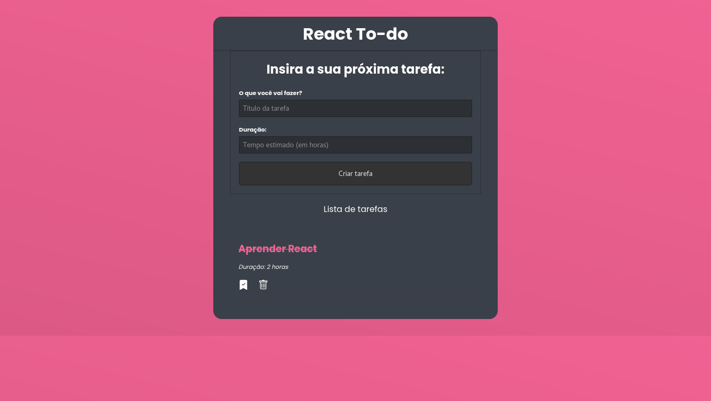

<h1 align="center"> React To-do List </h1>

  <a href="#-tecnologias">Tecnologias</a>&nbsp;&nbsp;&nbsp;|&nbsp;&nbsp;&nbsp;
  <a href="#-projeto">Projeto</a>&nbsp;&nbsp;&nbsp;|&nbsp;&nbsp;&nbsp;
  <a href="#gear-funcionamento">Funcionamento</a>

  

 

  

## 🚀 Tecnologias

Esse projeto foi desenvolvido com as seguintes tecnologias:

- HTML
- CSS
- JavaScript
- React
- Node js

## 💻 Projeto

To-do List que possibilita o gerenciamento de tarefas

## :gear: Funcionamento

Para que o projeto funcione é necessário seguir os seguintes passos:

- Rodar o comando "npm install" para instalar todas as dependências
- Inicializar o json-server com "npm run server"
- Inicializar o aplicativo com "npm start"

Vale lembrar que para o projeto eu utilizei o Node na versão v14.21.2 e o npm na versão v6.14.17

---
